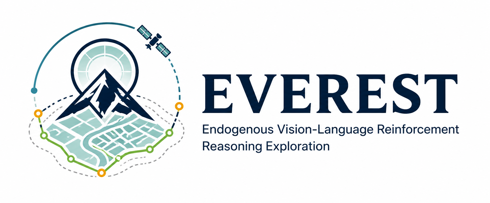
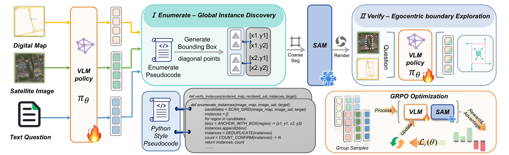

  

# EVEREST

**Endogenous Vision-Language Reinforcement Reasoning Exploration for Urban Socio-Semantic Segmentation**

EVEREST recovers the pixel-level extent of socially defined urban entities from a digital map, a spatially aligned satellite image, and a textual target. It actively enumerates candidate instances, renders coarse segmentation feedback, verifies instance boundaries, and produces executable box-and-point prompts for a frozen SAM2 segmenter.

## Contents

- [Overview](#overview)
- [Key Features](#key-features)
- [Architecture](#architecture)
- [Results](#results)
- [Installation](#installation)
- [Data Preparation](#data-preparation)
- [Training](#training)
- [Inference](#inference)
- [Configuration](#configuration)
- [Project Structure](#project-structure)

## Overview

Appearance alone is often insufficient to distinguish socially defined regions such as schools, hospitals, parks, residential areas, and commercial districts. EVEREST treats this task as an interactive multimodal reasoning problem rather than a one-shot mask prediction problem.

The shared vision-language policy first enumerates candidate entities with stable instance identities and bounding boxes. A frozen SAM2 model converts those boxes into a coarse mask, which is rendered back onto the aligned map and satellite image. The policy then verifies every indexed instance, chooses whether to keep, adjust, or drop it, and places positive boundary-refinement points. Because text generation, parsing, rendering, and segmentation are non-differentiable, the shared policy is optimized with group-relative reinforcement learning.

## Key Features

- **Pseudocode-guided enumeration** discovers candidate entities and anchors each one with a stable instance identity.
- **Egocentric verification** uses rendered map-satellite feedback to inspect boundaries and perform keep, adjust, or drop decisions.
- **Executable visual primitives** merge instance-aware boxes and positive points before frozen SAM2 execution.
- **Reinforcement reasoning optimization** trains the VLM across a non-differentiable parsing, rendering, and segmentation workflow.
- **Hierarchical urban semantics** supports Socio-name, Socio-class, and Socio-function targets.

## Architecture

  

The two coupled stages are:

1. **Enumerate:** <code>SCAN_GRID -> ANCHOR_WITH_BOX -> DEDUPLICATE -> COUNT_CONFIRM</code>.
2. **Verify:** <code>INSPECT -> DECIDE -> PLACE_POINT -> VERIFY_COUNT</code>.

Stable instance identities connect the two stages, allowing the verification stage to refine an existing candidate set instead of generating an unrelated prediction.

## Results

The manuscript reports the following SocioSeg results:

| Task | cIoU | F1 |
| --- | ---: | ---: |
| Socio-name | 53.0 | 64.3 |
| Socio-class | 50.5 | 61.5 |
| Socio-function | 44.4 | 54.9 |
| **Overall** | **50.4** | **61.4** |

EVEREST obtains the best average rank and the highest overall cIoU and F1 among the evaluated methods. The released configuration uses a Qwen2.5-VL-3B backbone, frozen SAM2, rollout batch size 128, group size 8, learning rate <code>1e-6</code>, clipping coefficient <code>0.5</code>, and KL weight <code>0.005</code>.

## Installation

### Requirements

- Linux with CUDA
- Python 3.10
- Four high-memory NVIDIA GPUs for the released 4-GPU configuration

Create the environment from the repository root:

~~~bash
conda create -n everest python=3.10 -y
conda activate everest
pip install torch==2.6.0 torchvision==0.21.0 torchaudio==2.6.0
pip install -r requirements.txt
pip install flash-attn==2.7.4.post1 --no-build-isolation --no-cache-dir
pip install "transformer-engine[pytorch]==2.2.0" deepspeed==0.16.4 vllm==0.8.4 --no-build-isolation
~~~

The launchers add the repository root to <code>PYTHONPATH</code>; an editable package installation is not required.

## Data Preparation

The dataset and model checkpoints are intentionally not included. Set <code>EVEREST_DATASET</code> to the SocioSeg root with the following layout:

~~~text
SocioSeg/
|-- train/
|   `-- <sample-id>/
|       |-- question.json
|       |-- map.png
|       |-- sat.png
|       `-- mask.png
|-- val/
|   `-- <sample-id>/
|       |-- question.json
|       |-- map.png
|       |-- sat.png
|       `-- mask.png
`-- test/
    `-- <sample-id>/
        |-- question.json
        |-- map.png
        |-- sat.png
        `-- mask.png
~~~

Each <code>question.json</code> must contain the <code>problem</code> field consumed by the data loader.

~~~bash
export EVEREST_DATASET=/absolute/path/to/SocioSeg
~~~

Optional cache and Ray temporary directories can be configured without editing source files:

~~~bash
export EVEREST_HF_HOME=/absolute/path/to/huggingface-cache
export EVEREST_RAY_TMPDIR=/absolute/path/to/ray-temp
~~~

## Training

The canonical training configuration starts from <code>Qwen/Qwen2.5-VL-3B-Instruct</code>.

~~~bash
export EVEREST_DATASET=/absolute/path/to/SocioSeg
bash examples/train.sh
~~~

On Slurm, pass resource requests at submission time so the launcher remains cluster-independent:

~~~bash
sbatch --gpus=4 --export=ALL,EVEREST_DATASET=/absolute/path/to/SocioSeg examples/train.sh
~~~

A timestamped runtime configuration is created under <code>examples/train/</code>. Checkpoints and logs are written below <code>examples/output/train/&lt;MM_DD_HH_MM&gt;/</code>.

## Inference

Point <code>EVEREST_CHECKPOINT</code> to a trained checkpoint. The path may contain the training timestamp; otherwise a sanitized checkpoint name is used for the inference run directory.

~~~bash
export EVEREST_DATASET=/absolute/path/to/SocioSeg
export EVEREST_CHECKPOINT=/absolute/path/to/checkpoint
bash examples/infer.sh
~~~

Inference artifacts are written below <code>examples/output/infer/infer_&lt;run-id&gt;/result/</code>, including stage-one masks, stage-two masks, rendered feedback, model responses, and aggregate metrics.

## Configuration

The canonical files are:

- <code>examples/train/rlvr_megatron.yaml</code>
- <code>examples/infer/rlvr_megatron.yaml</code>
- <code>examples/config/deepspeed_zero.yaml</code>
- <code>examples/config/deepspeed_zero2.yaml</code>
- <code>examples/config/deepspeed_zero3.yaml</code>
- <code>examples/config/deepspeed_zero3_cpuoffload.yaml</code>

Both canonical task configurations map the actor, inference, segmentation, and reference workers across four GPUs. Adjust the <code>device_mapping</code>, tensor-parallel size, batch sizes, and memory utilization for a different cluster.

The default models are:

- Vision-language backbone: <code>Qwen/Qwen2.5-VL-3B-Instruct</code>
- Promptable segmenter: <code>facebook/sam2-hiera-large</code>

## Project Structure

~~~text
EVEREST/
|-- assets/
|   |-- architecture.png
|   `-- everest-banner.png
|-- examples/
|   |-- config/
|   |-- infer/
|   |-- train/
|   |-- infer.sh
|   |-- train.sh
|   |-- start_rlvr_socioseg_pipeline.py
|   `-- start_rlvr_socioseg_pipeline_infer.py
|-- mcore_adapter/
|-- megatron/
|-- roll/
|-- requirements.txt
`-- README.md
~~~

Only training, inference, their runtime dependencies, and README assets are included. Datasets, checkpoints, experiment outputs, manuscript sources, tests, temporary files, and environment-specific launch variants are excluded.
